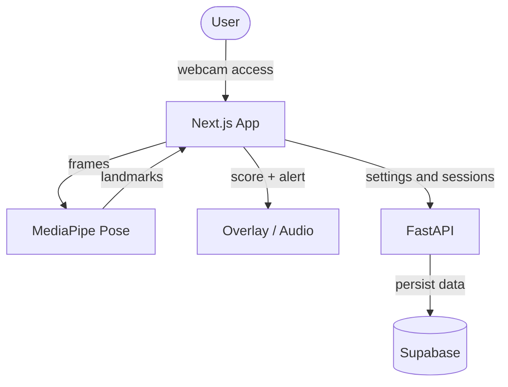

# StraightPosturizer - 제품 요구사항 문서

[English Version](PRD_EN.md)

StraightPosturizer는 웹캠과 브라우저 기반 자세 인식 모델을 이용해 사용자의 자세를 실시간으로 관찰하고, 자세가 무너지면 즉시 피드백을 주는 자세 교정 웹앱입니다. 이 문서는 무엇을 만들지, 누구를 위해 만드는지, MVP에서 어디까지 제공할지를 분명하게 정리하기 위한 기준 문서입니다.

---

## 1. 제품 한 줄 정의

컴퓨터 앞에 오래 앉아 있는 사용자가 스스로 자세를 인지하고 바로잡을 수 있게 돕는 실시간 자세 코치입니다.

---

## 2. 문제와 기회

장시간 앉아서 일하거나 공부하는 사용자는 본인도 모르게 거북목, 어깨 기울어짐, 상체 구부정함 같은 자세 문제를 반복합니다. 대부분의 사람은 자세가 무너지는 순간을 놓치기 때문에, "나중에 고쳐야지"가 아니라 "지금 바로 알아차리게 하는 도구"가 필요합니다.

StraightPosturizer는 이 지점을 노립니다.

- 자세가 무너진 사실을 늦지 않게 알려준다.
- 사용자가 별도 장비 없이 노트북 또는 데스크톱 웹캠만으로 사용할 수 있다.
- 데이터 처리를 가능한 한 브라우저 안에서 수행해 프라이버시 부담을 줄인다.

---

## 3. 대상 사용자

### 3.1 1차 대상

- 하루 대부분을 컴퓨터 앞에서 보내는 개발자
- 온라인 수업과 과제를 오래 하는 학생
- 문서 작업, 회의, 디자인 작업이 많은 직장인

### 3.2 사용자 특성

- 자세 교정의 필요성은 느끼지만 습관화가 어렵다.
- 장비 설치가 번거로운 제품은 오래 쓰지 않는다.
- 불필요하게 공격적인 알림보다 부드럽고 지속 가능한 피드백을 선호한다.

---

## 4. 제품 목표

### 4.1 사용자 목표

- 사용자가 자세가 무너지는 순간을 즉시 인지한다.
- 사용자가 자신의 "좋은 자세 기준"을 직접 설정할 수 있다.
- 사용자가 하루와 일주일 단위로 자세 습관 변화를 확인할 수 있다.

### 4.2 제품 목표

- 카메라 권한 허용 후 1분 이내에 첫 모니터링 세션을 시작할 수 있어야 한다.
- 자세 악화 감지부터 첫 피드백까지의 흐름이 자연스럽고 즉각적이어야 한다.
- MVP 단계에서는 단순하지만 신뢰할 수 있는 자세 점수와 세션 기록을 제공해야 한다.

---

## 5. 핵심 사용자 경험

사용자가 기대하는 기본 흐름은 다음과 같습니다.

1. 앱을 연다.
2. 카메라 권한을 허용한다.
3. 바른 자세를 취한 뒤 캘리브레이션을 한다.
4. 모니터링을 시작한다.
5. 자세가 무너지면 시각 또는 청각 알림을 받는다.
6. 세션을 종료하고 점수와 기록을 확인한다.

이 흐름은 처음부터 끝까지 복잡한 설정 없이 이어져야 합니다.

---

## 6. 기능 요구사항

### 6.1 실시간 자세 감지

- 브라우저에서 웹캠 영상을 받아온다.
- MediaPipe Pose 기반으로 얼굴과 상체의 주요 랜드마크를 추적한다.
- 최소한 코, 귀, 양쪽 어깨를 활용해 상체 자세를 평가한다.
- 처리 가능한 범위 내에서 브라우저 안에서 분석을 완료한다.

### 6.2 캘리브레이션

- 사용자가 "좋은 자세"를 취한 상태에서 기준값을 저장한다.
- 기준값에는 머리와 어깨의 상대 위치, 어깨 높이 대칭, 귀와 어깨 사이 관계가 포함된다.
- 이후의 점수 계산은 저장된 기준값과 현재 상태의 차이를 바탕으로 수행한다.

### 6.3 자세 점수 계산

MVP 기준으로 아래 세 가지 세부 점수를 계산한다.

- 거북목 점수
- 어깨 대칭 점수
- 구부정함 점수

그리고 이를 바탕으로 종합 점수를 계산한다.

점수 정책 요구사항:

- 점수는 사용자가 이해하기 쉬운 0~100 범위를 사용한다.
- 민감도 설정에 따라 임계값이 달라져야 한다.
- 점수는 실시간으로 갱신되어야 한다.

### 6.4 경고와 피드백

- 나쁜 자세가 일정 시간 이상 유지될 때만 경고를 발생시킨다.
- 기본 경고 지연 시간은 3초로 시작한다.
- 피드백 방식은 최소한 아래 두 가지를 지원한다.
  - 시각 경고: 화면 dim, blur, 혹은 경고 오버레이
  - 청각 경고: Web Audio API 기반 알림음
- 경고는 사용자가 자세를 회복하면 즉시 해제되어야 한다.

### 6.5 세션 관리

- 사용자는 모니터링 시작과 종료를 명시적으로 제어할 수 있어야 한다.
- 한 세션에는 시작 시각, 종료 시각, 총 사용 시간, 좋은 자세 유지 시간, 경고 횟수가 기록된다.
- 세션 종료 후 요약 정보를 사용자에게 보여준다.

### 6.6 히스토리와 대시보드

MVP 이후 또는 후반 단계에서 아래 기능을 제공한다.

- 최근 세션 목록
- 일간 자세 점수 추이
- 주간 경고 추이
- 자세가 가장 자주 무너지는 시간대 요약

### 6.7 사용자 설정

- 민감도 조절
- 경고 지연 시간 조절
- 시각 경고 on/off
- 오디오 경고 on/off
- 알림음 종류 선택

### 6.8 로그인과 계정

- Supabase Auth 기반 로그인 구조를 지원한다.
- MVP 초기에는 mock 사용자 흐름으로 먼저 동작해도 된다.
- 이후 Google, GitHub, 이메일 로그인으로 확장 가능해야 한다.

---

## 7. 비기능 요구사항

### 7.1 프라이버시

- 자세 분석은 가능한 한 클라이언트에서 처리한다.
- 사용자의 영상 원본은 저장하지 않는다.
- 서버에는 세션 결과와 설정 중심의 데이터만 저장한다.

### 7.2 성능

- 모니터링 화면은 실시간 피드백으로 느껴질 정도의 반응성을 유지해야 한다.
- 자세 점수 계산과 경고 처리로 인해 화면이 심하게 끊기면 안 된다.

### 7.3 안정성

- 카메라 권한 거부 시 대체 안내를 보여준다.
- 모델 로드 실패 시 사용자에게 재시도 가능한 상태를 제공한다.
- 백엔드 연결이 없어도 최소한 로컬 데모 흐름은 유지할 수 있어야 한다.

### 7.4 사용성

- 첫 실행부터 핵심 기능까지의 진입 장벽이 낮아야 한다.
- 경고는 강압적이기보다 습관 형성을 돕는 톤이어야 한다.

---

## 8. 기술 방향

| 영역 | 선택 기술 | 이유 |
| :--- | :--- | :--- |
| Frontend | Next.js App Router | 제품 화면, 상태 관리, 배포 흐름을 빠르게 구성하기 좋음 |
| Styling | Tailwind CSS | 빠른 UI 반복과 일관된 스타일링에 유리함 |
| Client AI | MediaPipe Pose | 브라우저 내 랜드마크 추적에 적합함 |
| Backend | FastAPI | 간단하고 빠르게 API를 구성할 수 있음 |
| Database/Auth | Supabase | 세션 저장과 사용자 인증을 함께 다루기 좋음 |
| Charts | Recharts | 자세 점수 및 경고 추이를 빠르게 시각화할 수 있음 |
| Hosting | Vercel + 별도 API 호스팅 | 프론트와 백엔드 배포를 분리하기 쉬움 |

---

## 9. 시스템 흐름

핵심 원칙은 다음과 같습니다.

- 자세 계산은 프론트엔드가 주도한다.
- 백엔드는 설정과 세션 기록 저장을 담당한다.
- 사용자 경험은 백엔드 연결이 없더라도 일부 데모가 가능해야 한다.

---

## 10. 데이터 모델 초안

### 10.1 `users`

- `id` UUID PK
- `email` VARCHAR UNIQUE
- `created_at` TIMESTAMP

### 10.2 `user_settings`

- `user_id` UUID PK, FK -> users.id
- `sensitivity` INT
- `alert_delay` INT
- `alert_visual` BOOLEAN
- `alert_audio` BOOLEAN
- `audio_type` VARCHAR
- `updated_at` TIMESTAMP

### 10.3 `posture_sessions`

- `id` BIGINT PK
- `user_id` UUID FK -> users.id
- `start_time` TIMESTAMP
- `end_time` TIMESTAMP
- `total_duration` INT
- `good_posture_duration` INT
- `alert_count` INT

---

## 11. MVP 범위

MVP에서 반드시 제공해야 하는 기능은 아래와 같습니다.

- 실제 모니터링 화면
- 카메라 연결
- 캘리브레이션
- 실시간 자세 점수
- 시각 또는 청각 경고
- 세션 시작/종료
- 세션 결과 저장

MVP 이후 확장 기능은 아래와 같습니다.

- 로그인 완성
- 사용자별 설정 저장
- 세션 히스토리 화면
- 차트 대시보드
- 배포 및 운영 환경 정리

---

## 12. 성공 기준

### 12.1 사용자 관점

- 사용자가 첫 세션을 큰 설명 없이 완료할 수 있다.
- 사용자가 경고가 왜 발생했는지 직관적으로 이해할 수 있다.
- 사용자가 세션 종료 후 자신의 자세 습관을 확인할 수 있다.

### 12.2 제품 관점

- 모니터링, 경고, 종료, 저장까지 기본 흐름이 끊기지 않는다.
- mock 모드와 Supabase 모드 모두에서 핵심 기능이 동작한다.
- 문서, 코드, 마일스톤이 서로 충돌하지 않는다.
