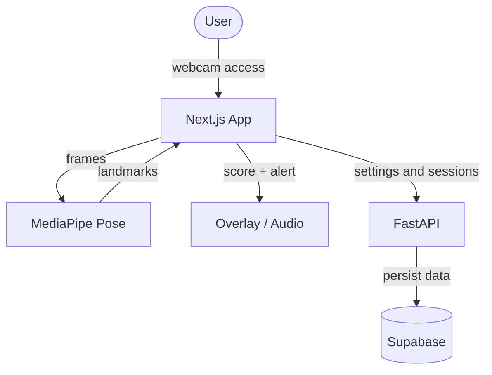

# StraightPosturizer - Product Requirements Document

[Korean Version](PRD.md)

StraightPosturizer is a browser-based posture coaching app that uses a webcam and on-device pose analysis to monitor posture in real time and respond when posture breaks down. This document defines what we are building, who it is for, and what the MVP must deliver.

---

## 1. Product Summary

StraightPosturizer is a real-time posture coach for people who spend long hours in front of a computer and need help noticing and correcting posture drift as it happens.

---

## 2. Problem and Opportunity

People who study or work at a computer for long periods often slip into forward-head posture, uneven shoulders, and a slouched upper body without realizing it. The real problem is not only poor posture itself, but the delay in noticing it.

StraightPosturizer focuses on that gap.

- It tells the user when posture has already started to degrade.
- It works with a normal laptop or desktop webcam, without extra hardware.
- It keeps analysis inside the browser whenever possible to reduce privacy concerns.

---

## 3. Target Users

### 3.1 Primary Users

- Developers who sit at a desk most of the day
- Students who spend hours in online classes or coursework
- Office workers doing long-form computer work

### 3.2 User Traits

- They know posture matters, but struggle to maintain it consistently.
- They are unlikely to keep using a product that requires complex setup.
- They prefer calm, sustainable feedback over aggressive alerts.

---

## 4. Product Goals

### 4.1 User Goals

- Help users notice posture breakdown immediately.
- Let users define a personal baseline for what "good posture" means.
- Show progress over daily and weekly timeframes so habit change feels visible.

### 4.2 Product Goals

- A first monitoring session should be possible within one minute after camera permission is granted.
- The detection-to-feedback loop should feel immediate and natural.
- The MVP should deliver simple but trustworthy posture scoring and session tracking.

---

## 5. Core User Experience

The intended baseline flow is:

1. Open the app.
2. Allow camera access.
3. Sit upright and calibrate.
4. Start monitoring.
5. Receive visual or audio feedback when posture degrades.
6. End the session and review the result.

This flow should remain simple from first use to session completion.

---

## 6. Functional Requirements

### 6.1 Real-Time Posture Detection

- Capture webcam video in the browser.
- Use MediaPipe Pose to track core upper-body landmarks.
- At minimum, evaluate posture from the nose, ears, and both shoulders.
- Keep posture analysis on the client where practical.

### 6.2 Calibration

- Let the user save a "good posture" baseline.
- The baseline should include head-to-shoulder relationships, shoulder symmetry, and ear-to-shoulder positioning.
- All later posture scoring should compare current posture to that saved baseline.

### 6.3 Posture Scoring

The MVP should calculate at least these three scores:

- Turtle neck score
- Shoulder symmetry score
- Slump score

These scores roll up into an overall posture score.

Scoring requirements:

- Scores should use an intuitive 0-100 range.
- Thresholds should adapt to the user's sensitivity setting.
- Scores should update live during monitoring.

### 6.4 Alerts and Feedback

- Alerts should fire only when bad posture persists beyond a configurable delay.
- The default delay should start at 3 seconds.
- The product must support at least:
  - Visual feedback such as dimming, blur, or a warning overlay
  - Audio feedback using the Web Audio API
- Alerts should clear immediately when posture recovers.

### 6.5 Session Management

- Users must be able to start and stop monitoring explicitly.
- Each session should record start time, end time, total duration, good posture duration, and alert count.
- A short session summary should appear after the session ends.

### 6.6 History and Dashboard

For MVP follow-up or later phases, the product should support:

- A recent sessions list
- Daily posture score trends
- Weekly alert trends
- A simple summary of the time of day when posture breaks down most often

### 6.7 User Settings

- Sensitivity adjustment
- Alert delay adjustment
- Visual alert on/off
- Audio alert on/off
- Alert sound selection

### 6.8 Authentication and Identity

- The long-term plan is to support Supabase Auth.
- Early MVP work can use a mock user flow first.
- The system should later expand to Google, GitHub, and email sign-in.

---

## 7. Non-Functional Requirements

### 7.1 Privacy

- Posture analysis should stay on the client whenever possible.
- Raw webcam footage must not be stored.
- Only settings and session results should be persisted to the backend.

### 7.2 Performance

- Monitoring must feel responsive enough to support live feedback.
- Posture scoring and alert handling must not make the UI unusably choppy.

### 7.3 Reliability

- The app must handle camera permission denial gracefully.
- If pose model loading fails, the user should see a recoverable error state.
- A local demo flow should still be possible even without backend connectivity.

### 7.4 Usability

- The path from first launch to active monitoring should be low friction.
- Alerts should feel supportive and habit-forming, not punishing.

---

## 8. Technical Direction

| Area | Technology | Why |
| :--- | :--- | :--- |
| Frontend | Next.js App Router | Strong fit for the app shell, stateful UI, and deployment workflow |
| Styling | Tailwind CSS | Fast iteration and consistent styling |
| Client AI | MediaPipe Pose | Good fit for browser landmark tracking |
| Backend | FastAPI | Lightweight way to build the API surface quickly |
| Database/Auth | Supabase | Useful for both persistence and authentication |
| Charts | Recharts | Fast way to visualize posture and alert trends |
| Hosting | Vercel + separate API hosting | Simple split between frontend and backend deployment |

---

## 9. System Flow

Core architectural principles:

- The frontend owns posture analysis.
- The backend owns settings and session persistence.
- The product should still support a partial demo experience without backend connectivity.

---

## 10. Draft Data Model

### 10.1 `users`

- `id` UUID PK
- `email` VARCHAR UNIQUE
- `created_at` TIMESTAMP

### 10.2 `user_settings`

- `user_id` UUID PK, FK -> users.id
- `sensitivity` INT
- `alert_delay` INT
- `alert_visual` BOOLEAN
- `alert_audio` BOOLEAN
- `audio_type` VARCHAR
- `updated_at` TIMESTAMP

### 10.3 `posture_sessions`

- `id` BIGINT PK
- `user_id` UUID FK -> users.id
- `start_time` TIMESTAMP
- `end_time` TIMESTAMP
- `total_duration` INT
- `good_posture_duration` INT
- `alert_count` INT

---

## 11. MVP Scope

The MVP must include:

- A real monitoring screen
- Camera connection
- Calibration
- Live posture scoring
- Visual or audio alerts
- Session start and stop controls
- Session result saving

Later expansion can include:

- Completed authentication
- Persisted per-user settings
- Session history views
- Dashboard charts
- Production deployment and operations cleanup

---

## 12. Success Criteria

### 12.1 User Success

- A first-time user can complete a session without heavy guidance.
- Users can understand why an alert fired.
- Users can review their posture outcome after a session.

### 12.2 Product Success

- The monitoring, alerting, ending, and saving flow works end to end.
- Core features function in both mock mode and Supabase-backed mode.
- The codebase, roadmap, and docs stay aligned.
